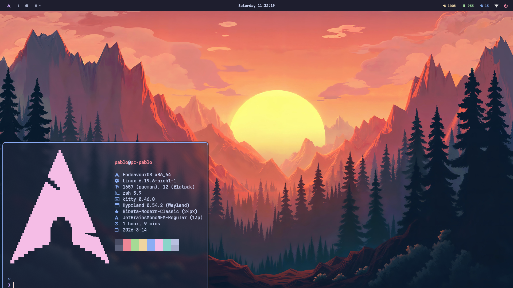

# Linux Desktop Dotfiles - Hyprland

[](LICENSE)
[](https://archlinux.org)
[](https://endeavouros.com)

> [!WARNING]
> Personal dotfiles. If you don't know what you're doing, don't install them — zero stability guarantees.

Modern, modular configuration for Arch Linux & Arch-based distros.



## Stack

| Category         | Tool       |
|------------------|------------|
| WM               | Hyprland   |
| Terminal         | Kitty      |
| Shell            | Zsh        |
| Editor           | Neovim     |
| Bar              | Waybar     |
| Launcher         | Rofi       |
| Notifications    | Mako       |
| Lock screen      | Hyprlock   |
| Idle daemon      | Hypridle   |
| Logout menu      | Wlogout    |
| Display manager  | Ly         |
| File manager     | Yazi       |
| Fetch            | Fastfetch  |

## Prerequisites

- **OS**: Arch Linux or Arch-based distros (tested on **EndeavourOS**)
- **Package Manager**: Pacman + Paru (AUR helper)
- **Git**
- *Systemd*

## Installation

```bash
# 1. Clone
git clone --recurse-submodules https://codeberg.org/Novbi/dotfiles ~/dotfiles

# 2. Change directory
cd ~/dotfiles

# 3. Make install script executable
chmod +x install

# 4. Launch script (installs dependencies and symlinks config)
./install
```

## Structure

- **home/** - Files symlinked to `$HOME` (.zshenv, .gitconfig, etc)
- **dots/** - WM-agnostic apps (VSCode, Kitty)
- **hyprland/** - Wayland/Hyprland ecosystem (replaceable with other WM)
- **shell/** - Zsh config, Neovim, and CLI/TUI tools
- **system/** - OS-level config (`~/.config`), note that `system/system` does not create symlinks
- **wallpapers/** - Wallpapers

---

## 📄 License

MIT — feel free to use and modify. See [LICENSE](LICENSE) for full terms.

---
